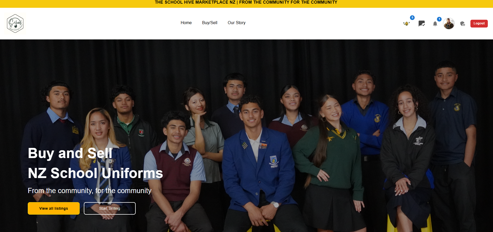
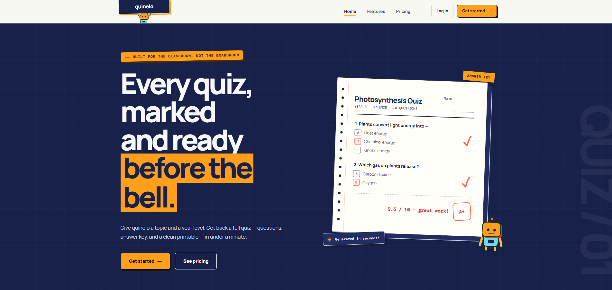
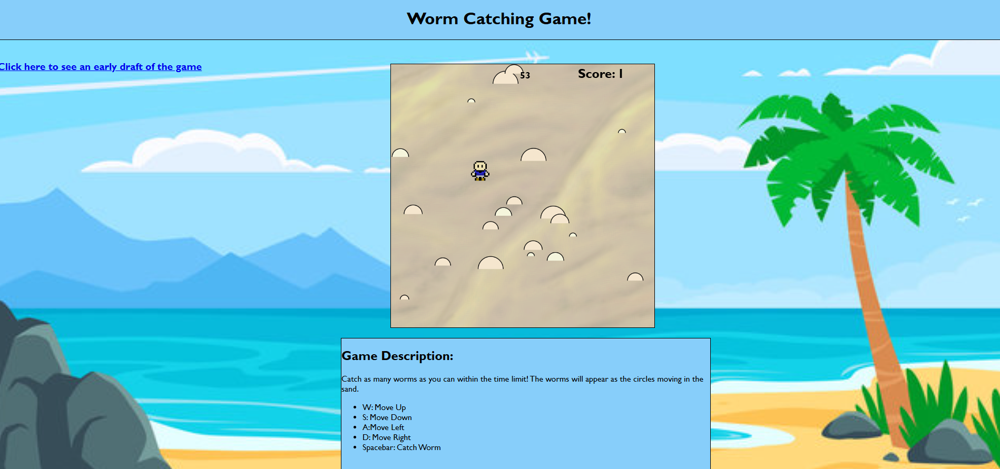

  

  <a href="https://quinton-portfolio-nine.vercel.app/">Portfolio</a> &nbsp; · &nbsp;
  <a href="https://quinton-portfolio-nine.vercel.app/cv">View my CV</a> &nbsp; · &nbsp;
  <a href="https://www.linkedin.com/in/quinton-gillanders-335985297/">LinkedIn</a> &nbsp; · &nbsp;
  <a href="mailto:quingillanders@gmail.com">Email me</a>

## A little about me

I'm Quinton, a Full Stack Software Developer based in Auckland, New Zealand. I completed a **Bachelor of Computing Systems at Unitec in 2025**, with a focus on software development.

I enjoy building responsive web applications with React, JavaScript, Firebase, and Material UI. My projects include a community marketplace for school essentials and an education tool to help teachers prepare quizzes.

- **Building:** quinelo, an AI-assisted quiz creation tool currently in closed beta.
- **Proud of:** building SchoolHIVE with team QAK404 and winning first place at the Unitec Whānau Day Showcase in November 2025.
- **Exploring:** how AI can help people with everyday tasks, especially in education.

## Featured projects

<table>
  <tr>
    <td width="50%" valign="top">
      
      <h3>SchoolHIVE Marketplace NZ</h3>
      
A community marketplace helping families access school uniforms and essentials. Built with two teammates for our 2025 Unitec capstone project.

      
<strong>React · Firebase · Material UI</strong>

      
First place at the Unitec Whānau Day Showcase, and featured on RNZ.

      
<a href="https://www.schoolhive.co.nz/">Visit website</a> · <a href="https://quinton-portfolio-nine.vercel.app/schoolhive">Case study</a>

    </td>
    <td width="50%" valign="top">
      
      <h3>quinelo</h3>
      
An education tool I'm developing to help teachers save time preparing quizzes, with AI generated questions and downloadable classroom PDFs.

      
<strong>React · CSS · Firebase · OpenAI</strong>

      
In closed beta, with feedback from testers at Success Tutoring New Lynn.

      
<a href="https://www.quinelo.co.nz">Visit website</a> · <a href="https://quinton-portfolio-nine.vercel.app/quinelo">Case study</a>

    </td>
  </tr>
</table>

### Worm Catching Game

A browser game I built in 2024 during my Unitec bachelor of computing systems, using **HTML, CSS, and JavaScript**. Catch moving worms before time runs out, using keyboard controls and sound effects along the way.

[Play the game](https://quintongillanders.github.io/wormcatchinggame.github.io/) · [Read the case study](https://quinton-portfolio-nine.vercel.app/wormcatchinggame)

## Projects I'm working on

- **TutorOS:** More details on TutorOS will be shared in the coming months.
- **Hazard ID:** A hazard identification and tracking tool built to help streamline safety reporting and risk management workflows. Coming soon!

## My toolkit

| Web development | Backend & tools | Other languages I've used |
| :--- | :--- | :--- |
| React, JavaScript, HTML, CSS, Material UI | Firebase, OpenAI | Python, Java, C# |

## Beyond the code

Before moving into software development, I worked in manufacturing at **New Zealand Insulators** and in my family's strawberry business, **Danube Orchards**. Those experiences shaped how I work with people and approach practical problems.

In July 2026, I also helped young students explore AI through workshops at **Success Tutoring New Lynn**.

Outside coding, you'll usually find me gaming, at the gym, going for a run, watching a series, or catching up with family and friends. I'm a big Rockstar Games fan.

---

  <strong>Have a project in mind, or want to say hello?</strong> 
  <a href="mailto:quingillanders@gmail.com">Get in touch</a> · <a href="https://quinton-portfolio-nine.vercel.app/">Explore my portfolio</a>

